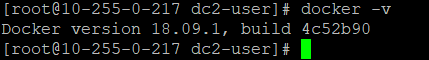

### 操作预览：
1.  安装一些基本依赖软件
2.  为了使用 yum-config-manager 需要先安装一下 yum-utils
3.  设置稳定版仓库
4.  更新仓库（可选）
5.  查看所有仓库中所有docker版本（可选）
6.  正式下载安装
7.  启动 (并开机启动)
8.  检查是否安装成功

<!--more--> 

////////////////////////////////////////////// 
前戏准备 
//////////////////////////////////////////////


###### 1、安装一些基本依赖软件
```bash
$ sudo yum install -y yum-utilsdevice-mapper-persistent-data lvm2
```

###### 2、为了使用 yum-config-manager 需要先安装一下这个 yum-utils
```bash
$ sudo yum -y install yum-utils
```

###### 3、设置稳定版仓库
```bash
$ sudo yum-config-manager --add-repo https://download.docker.com/linux/centos/docker-ce.repo
```

###### 4、更新仓库（可选）
```bash
$ sudo yum-config-manager --enable docker-ce-edge
```

////////////////////////////////////////////// 
正式开始 
//////////////////////////////////////////////


###### 5、查看所有仓库中所有docker版本（可选）
```bash
$ sudo yum list docker-ce --showduplicates | sort -r
```

###### 6、正式下载安装
```bash
$ sudo yum install docker-ce -y
```

###### 7、启动 (并开机启动)
```bash
$ sudo systemctl start docker
$ sudo systemctl enable docker
```

###### 8、检查是否安装成功
```bash
$ docker -v
```

