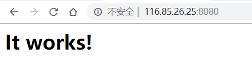

<hr>

```bash
$ sudo docker run -d -p 8080:80 httpd
```

1）从 Docker Hub 下载 httpd 镜像。镜像中已经安装好了 Apache HTTP Server.
2）启动容器，并将容器的80端口映射到宿主机的8080端口。

这样当我们访问宿主机的8080端口时，就能看到HTTP服务页面了。

<!--more--> 

> 如果外网ip访问不了。请确保你服务器的安全组，以及本机的防火墙配置。

```bash
$ curl localhost:8080

<html><body><h1>It works!</h1></body></html>
```




