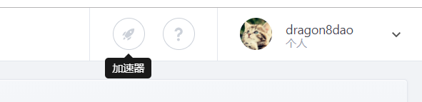
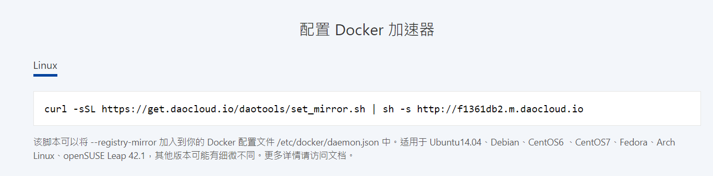

<hr>

切换国内 [DaoCloud](https://dashboard.daocloud.io/settings/profile) 镜像服务。 [免费注册](https://account.daocloud.io/signup)后进入控制台，找到右上角的[加速器图标](https://www.daocloud.io/mirror)。



然后找到Linux的配置命令。



你的配置命令也许和我的不一样哦。

```bash
$ curl -sSL https://get.daocloud.io/daotools/set_mirror.sh | sh -s http://f1361db2.m.daocloud.io

$ sudo systemctl restart docker
```


