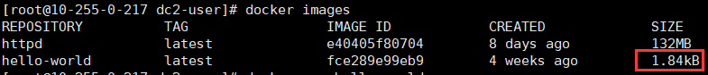

<hr>

hello-world 是 Docker 官方提供的一个镜像。通常用来验证 Docker 是否安装成功。 我们先通过 `$ docker pull` 从 Docker Hub 下载它。
```bash
$ docker pull hello-world
```

<!--more--> 

使用 `$ docker images` 查看镜像是否下载成功。 发现才不到2kb！ 



通过 `$ docker run` 运行它。

```bash
$ docker run hello-world

Hello from Docker!
This message shows that your installation appears to be working correctly.
...
```

<hr>

Dockerfile 是镜像的描述文件，定义了如何构建 Docker 镜像。

> 注：可以在 [dockerhub](https://hub.docker.com/_/hello-world?tab=description) 中查看 Dockerfile 内容


