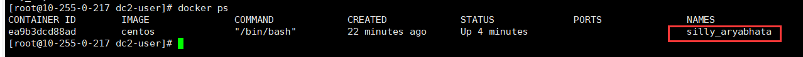
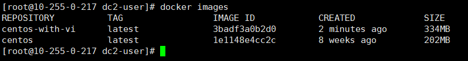

<hr>

docker commit 命令是创建新镜像最直接的方法，其过程包含三个步骤：
- 运行容器
- 修改容器
- 将容器保存为新镜像

###### （1）运行容器
```bash
[root@10-255-0-217 dc2-user]# docker run -it centos

Unable to find image 'centos:latest' locally
latest: Pulling from library/centos
a02a4930cb5d: Pulling fs layer 
latest: Pulling from library/centos
a02a4930cb5d: Pull complete 
Digest: sha256:184e5f35598e333bfa7de10d8fb1cebb5ee4df5bc0f970bf2b1e7c7345136426
Status: Downloaded newer image for centos:latest

[root@ea9b3dcd88ad /]# 
```

自动下载了最新版本的 Centos 镜像，并且运行和进入了容器（ea9b3dcd88ad）。

<!--more--> 

###### (2) 修改容器

这里示例安装 vim 

```bash
[root@ea9b3dcd88ad /]# vim
bash: vim: command not found

[root@ea9b3dcd88ad /]# yum install -y vim
...
Complete!
```

###### (3) 保存为新镜像

让容器继续运行着，然后 `新建窗口` 来查看当前运行的镜像。
```bash
[root@10-255-0-217 dc2-user]# docker ps
```


`silly_aryabhata` 是 Docker 为我们的容器随机分配的名字。

执行 `docker commit` 命令将容器保存为镜像。

```bash
[root@10-255-0-217 dc2-user]# docker commit silly_aryabhata centos-with-vi

sha256:3badf3a0b2d0a59bd3cd106e70d088c32da2e59676746e7613a30f7eb5d3e2b0
```



对比两个镜像，从 `SIZE` 上看到镜像因为安装了 `vim` 软件而变大了。

<hr>

以上演示了如何用 `docker commit` 创建新镜像。

> 然而，Docker 并不建议用户通过 `docker commit` 这种方式构建镜像。

### 原因如下：

1. 这是一种手工创建镜像的方式，容易出错，效率低且重复性弱。比如要在ubuntu镜像中也加入vim，还得重复前面所有步骤。
2. 使用者并不知道镜像是如何创建出来的，里面提供什么服务，包含什么程序，里面是否有恶意程序？也就是说无法对镜像进行审计，存在安全隐患。

既然 `docker commit` 不是推荐的方法，我们为什么还要花时间学习呢？

> 即便是用 dockerfile（推荐方法）构建镜像，底层也是 `docker commit` 一层一层构建镜像的。学习 `docker commit` 能够帮助我们更加深入的理解构建过程和镜像的分层结构。