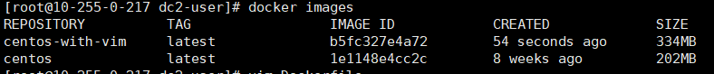

<hr>

Dockerfile 是一个文本文件，记录了镜像构建的所有步骤。

```bash
$ vim Dockerfile
```
Dockerfile 内容如下：

> FROM centos
> RUN yum install -y vim

开始构建，请注意最后一个`.` 它指明在当前路径寻找 Dockerfile
```bash
$ docker build -t centos-with-vim .
```

经过漫长的安装之后。我们查看一下镜像列表 `$ docker images`:



可以看到 Docker 分为了两个镜像： `centos` 和 `centos-with-vim`。

其中 `centos` 镜像我们称为base镜像。而 `centos-with-vim` 就是基于base镜像构建的。

如果在构建之前你的本地镜像已经存在base镜像。那么会跳过下载直接继承该镜像。这也是 docker 的重要特性。
