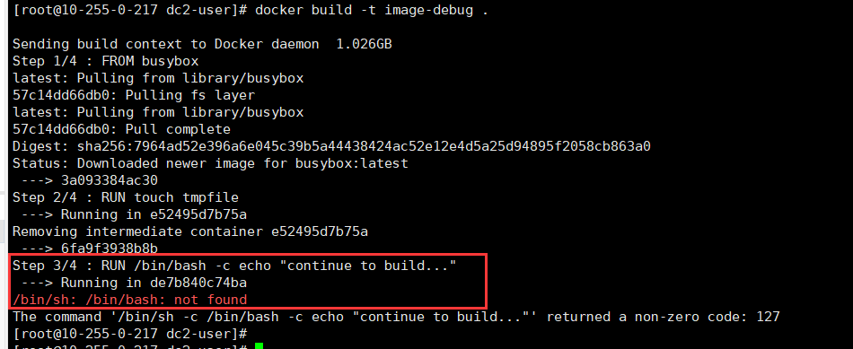
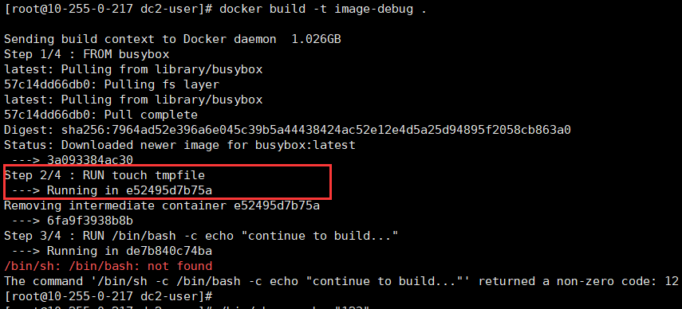
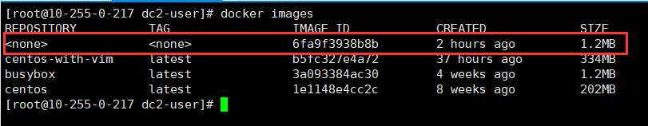

<hr>

总结一下 `dockerfile` 的构建镜像的过程：
1. 从 base 镜像运行一个容器。
2. 执行一条指令，对容器做修改。
3. 执行类似 `docker commit` 的操作，生成一个新的镜像层。
4. Docker 再基于刚刚提交的镜像运行一个新容器。
5. 重复 2 ~ 4 步，直到 `dockerfile` 中所有的指令执行完毕。

从这个过程可以看出，**如果 `dockerfile` 由于某种原因执行到某个指令失败了，我们也能够得到前一个指令成功执行构建出的镜像。**

这样当我们修复完bug再次执行构建的时候，也能依靠docker的缓存特性跳过已完成的镜像。这对开发和调试 `dockerfile` 是非常友好且有帮助的。我们可以通过控制台的打印和测试，快速定位错误和分析原因。

<!--more--> 

<hr>

我们来看一个调试示例，以 buysbox 为 base 镜像：

> BusyBox 是一个集成了三百多个最常用Linux命令和工具的软件。BusyBox 包含了一些简单的工具，例如ls、cat和echo等等，还包含了一些更大、更复杂的工具，例grep、find、mount以及telnet。有些人将 BusyBox 称为 Linux 工具里的瑞士军刀。

新建一个 `Dockerfile` 和一个测试文件 `testfile`:
```bash
[root@10-255-0-217 dc2-user]# echo test > testfile
[root@10-255-0-217 dc2-user]# vim Dockerfile
```
Dockerfile 内容如下：
> FROM busybox
> RUN touch tmpfile
> RUN /bin/bash -c echo "continue to build..."
> COPY testfile /

开始构建调试
```bash
[root@10-255-0-217 dc2-user]# docker build -t image-debug .
```


我们可以轻松发现在执行第三句指令： `RUN /bin/bash -c echo "continue to build..."` 的时候发生了异常，

错误信息是: `/bin/sh: /bin/bash: not found`

很显然我们得知了 buysbox 系统中不包含 /bin/bash 程序。然后再进一步的修正。

<hr>

上述这种错误是比较简单且显而易见的，大部分的bug都是难以肉眼观察，我们希望进一步的调试。

根据 `Dockerfile` 构建镜像的特性，尽管由于某种原因执行到某个指令失败了，我们也能够得到前一个指令成功执行构建出的镜像。

在此例子中，就是由 `RUN touch tmpfile` 指令构成的镜像 `6fa9f3938b8b`：



我们也可以从 `docker images` 中查看最后成功的镜像：



然后我们进入镜像之中进一步的操作体验和调试：
```bash
[root@10-255-0-217 dc2-user]# docker run -it 6fa9f3938b8b
/ # /bin/bash -c echo "continue to build..."
sh: /bin/bash: not found
/ # 
```

依然能得出 `/bin/bash: not found` 的错误定位结果。