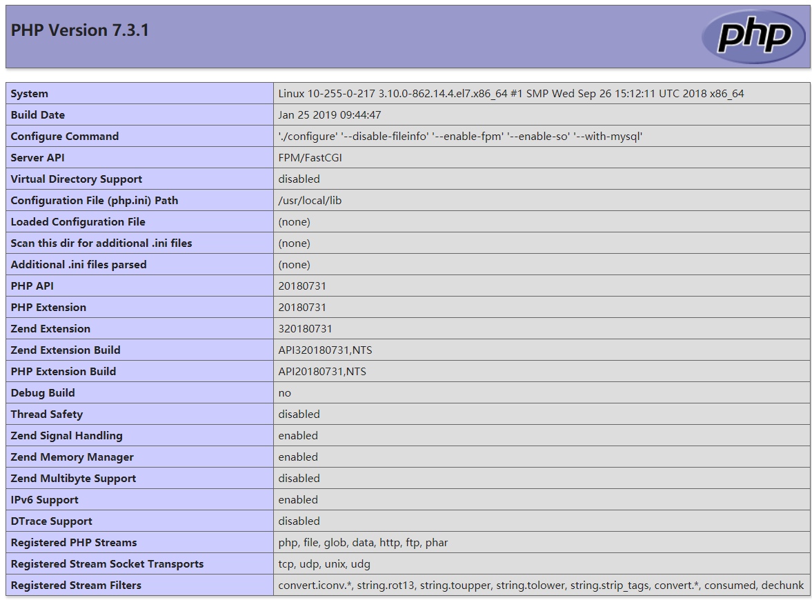

<hr>

### 传送门：
- [Centos7 PHP-lastest 安装](/2019/01/25/php安装/)
- [centos7 nginx 安装](/2019/01/24/nginx安装/)

###### 1. 配置 Nginx 使其支持 PHP 应用

`$ vim /usr/local/nginx/conf/nginx.conf`，修改默认的 location 块，使其支持 .php 文件：

```nginx
location / {
    root   html;
    index  index.php index.html index.htm;
}
```

###### 2. 配置 .php 文件的请求将被传送到后端的 PHP-FPM 模块
```nginx
location ~* \.php$ {
    fastcgi_index   index.php;
    fastcgi_pass    127.0.0.1:9000;
    include         fastcgi_params;
    fastcgi_param   SCRIPT_FILENAME    $document_root$fastcgi_script_name;
    fastcgi_param   SCRIPT_NAME        $fastcgi_script_name;
}
```

###### 3. 将 php.ini 文件中的配置项 cgi.fix_pathinfo 设置为 0
```bash
$ vim /usr/local/php/php.ini
```
定位到 `cgi.fix_pathinfo` 并将其修改为如下所示：

> cgi.fix_pathinfo=0

###### 4. 修改 `php-fpm.conf` 路径引用错误的bug

```bash
$ vim /usr/local/etc/php-fpm.conf
```

找到最后一行 `include=NONE/etc/php-fpm.d/*.conf`，改为 `include=etc/php-fpm.d/*.conf`

> include=NONE/etc/php-fpm.d/*.conf
> 改为
> include=etc/php-fpm.d/*.conf

###### 5. 添加 www.conf，并且修改权限
```bash
$ cd /usr/local/etc/php-fpm.d
$ cp www.conf.default www.conf
$ vim www.conf
```

找到并修改以下内容：

```bash
; Unix user/group of processes
; Note: The user is mandatory. If the group is not set, the default user's group
;       will be used.
user = nobody
group = nobody
```

##### 3. 重启 Nginx。
```bash
$ sudo /usr/local/nginx/sbin/nginx -s stop
$ sudo /usr/local/nginx/sbin/nginx
```

##### 4. 创建测试文件
```bash
$ rm /usr/local/nginx/html/index.html
$ echo "<?php phpinfo(); ?>" >> /usr/local/nginx/html/index.php
```


