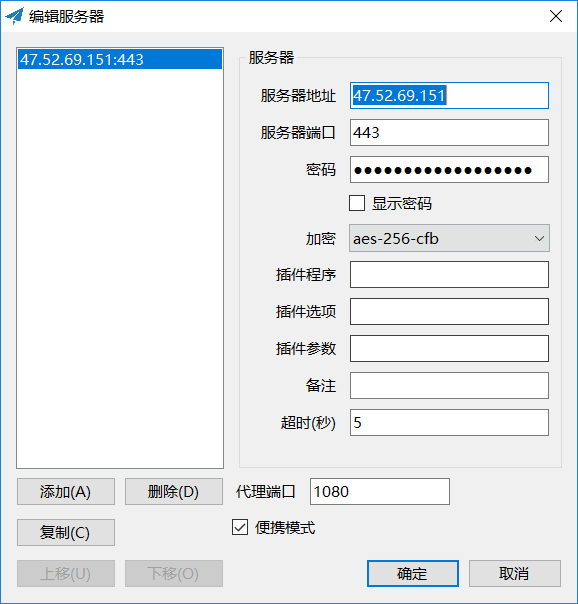
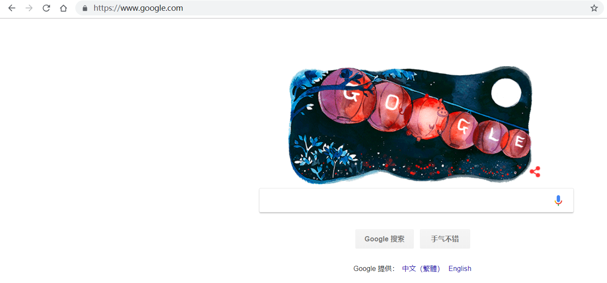

<hr>


教程传送门：
[阿里云主机搭建VPN服务](https://blog.csdn.net/ztx114/article/details/80423705)
[在免费EC2上搭建自己的VPN](https://my.oschina.net/imcf/blog/659230)

#### 1、安装python 和 Pip
```
$ yum install python-setuptools && easy_install pip -y
```

#### 2、安装 shadowsocks
```
$ pip install shadowsocks
```

#### 3、添加 shadowsocks 的配置文件
```
$ vim /etc/shadowsocks.json
{
    "server": "0.0.0.0",
    "server_port": 443,
    "local_address": "127.0.0.1",
    "local_port": 1080,
    "password": "daweiyixiangshihao",
    "timeout": 300,
    "method": "aes-256-cfb",
    "fast_open": false,
    "workers": 1
}
```

- server_port：是开放端口，阿里云默认开放了443;
- password：是连接密码;
- server：就是本机，保持0.0.0.0 即可;
- method：是传输方式，保持"aes-256-cfb" 即可;

#### 4、启动 shadowsocks 服务
```
$ ssserver -c /etc/shadowsocks.json -d start
```

#### 5、本机下载  shadowsocks.exe 
链接：https://pan.baidu.com/s/17y-v40jPGIHcftuE7gGiEA 
提取码：5gzb 

#### 6、配置 shadowsocks.exe 


#### 7、访问google.com 测试


