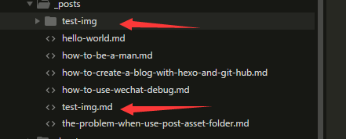

安装 [hexo-asset-image](https://github.com/CodeFalling/hexo-asset-image)

```bash
$ cnpm install hexo-asset-image --save
```

**_config.yml** 开启 **post_asset_folder: true**

```yaml
post_asset_folder: true
```

完成安装后用hexo新建文章的时候会发现_posts目录下面会多出一个和文章名字一样的文件夹。



只需要使用该语句即可插入图片

```

```