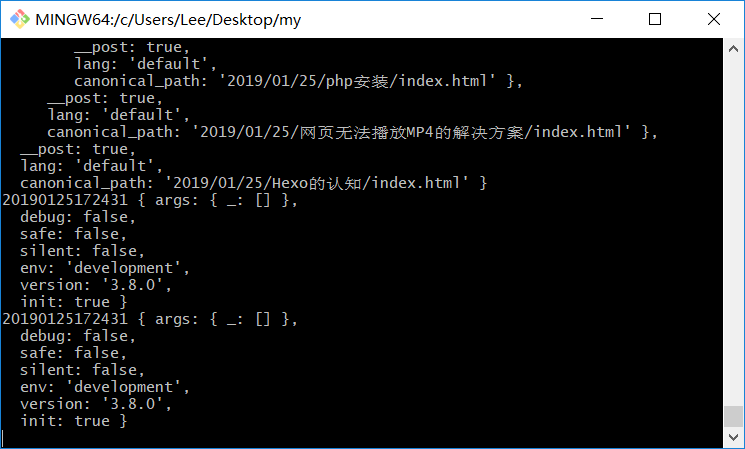

<hr>

### 预览：
1. 自定义文章模板
2. 加入 `<script>`
3. 加入全局样式
4. hexo 内置全局变量
5. 如何打印全局变量
6. 本地搜索功能
7. 部署的git和项目的git


#### 1. 自定义文章模板
> \themes\landscape\layout\_partial\after-footer.ejs

#### 2. 加入 `<script>`
> \scaffolds\post.md

#### 3. 加入全局样式
> \my\themes\landscape\source\css\style.styl

#### 4. hexo 内置全局变量
> [https://hexo.io/zh-cn/docs/variables](https://hexo.io/zh-cn/docs/variables)

#### 5. 如何打印全局变量
打开任意一个ejs文件如：`my\themes\landscape\layout\_partial\article.ejs`，顶部加入JavaScript代码：
```ejs
<% 
	console.log(20190125172431, post) 
%>
```
不过并不会打印到页面，而是打印到控制台。



#### 6.本地搜索功能

需要结合插件 [hexo-generator-search](https://github.com/wzpan/hexo-generator-search) 来使用：

```bash
$ cnpm install https://github.com/wzpan/hexo-generator-search
```
配置 `_config.yml`

> search:
>   path: search.json
>   field: post
>   content: true

当你使用 `$ hexo g` 之后，publish 目录下就生成了search.json了。我们就可以根据这个json来做本地搜索。

#### 7. 部署的git和项目的git

我们希望部署/publish到github.io和项目本身的git不一样。只需要加入一个 [hexo-deployer-git](https://github.com/hexojs/hexo-deployer-git) 插件即可。

```bash
$ cnpm install hexo-deployer-git
```

配置 `_config.yml`

```yml
# Deployment
## Docs: https://hexo.io/docs/deployment.html
deploy:
  type: git
  repository: https://github.com/dragon8github/dragon8github.github.io.git
  branch: master
```

这样我们就可以使用 `$ hexo g && hexo d` 来部署到github.io了。就不会和我们项目本身的git冲突了。