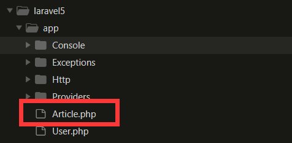
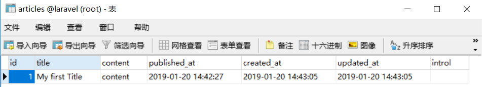

# 一、数据建模

创建一个名为 `Article` 的 Eloquent Model，Laravel 会自动将其与 Article 数据表关联。
<!--more--> 
```php
$ php artisan make:model Article
```



<hr>

# 二、tinker 命令行交互

输入以下命令进入交互模式：

```bash
$ php artisan tinker
```

#### 示例 1 - Model与插入数据：

```bash
>>> $article = new App\Article;
=> App\Article {#2909}

>>> $article->title='My first Title';
=> "My first Title"

>>> $article->content='content'
=> "content"

>>> $article->published_at=Carbon\Carbon::now();
=> Carbon\Carbon @1547995347 {#2913
     date: 2019-01-20 14:42:27.721241 UTC (+00:00),
   }

>>> $article;
=> App\Article {#2909
     title: "My first Title",
     content: "content",
     published_at: Carbon\Carbon @1547995347 {#2913
       date: 2019-01-20 14:42:27.721241 UTC (+00:00),
     },
   }

>>> $article->save();
=> true
>>>
```

代码说明：
- `$article = new App\Article` ： 新建一个 Article Model；
- `$article->title='My first Title'`：填充title字段；
- `$article->content='content'`：填充content字段；
- `$article->published_at=Carbon\Carbon::now()`： 使用 `Carbon\Carbon` 时间库来获取并设置当前时间；
- `$article`：打印出当前的Model；
- `$article->save()`：保存到数据库，如果返回true则表示成功；





也可以使用 `$article->toArray()` 打印出 Model 信息：
```bash
>>> $article->toArray()
=> [
     "title" => "My first Title",
     "content" => "content",
     "published_at" => Carbon\Carbon @1547995347 {#2913
       date: 2019-01-20 14:42:27.721241 UTC (+00:00),
     },
     "updated_at" => "2019-01-20 14:43:05",
     "created_at" => "2019-01-20 14:43:05",
     "id" => 1,
   ]
>>>
```

#### 示例 2 - 查找数据

查找刚刚插入 `id` 为 **1** 的数据：

```bash
>>> $data = App\Article::find(1);
=> App\Article {#2924
     id: 1,
     title: "My first Title",
     content: "content",
     published_at: "2019-01-20 14:42:27",
     created_at: "2019-01-20 14:43:05",
     updated_at: "2019-01-20 14:43:05",
     introl: "",
   }
>>>
```

也可以使用 `App\Article::all()` 方法无条件查找所有数据：

```bash
>>> $data=App\Article::all()

=> Illuminate\Database\Eloquent\Collection {#2924
     all: [
       App\Article {#2906
         id: 1,
         title: "My first Title",
         content: "content",
         published_at: "2019-01-20 14:42:27",
         created_at: "2019-01-20 14:43:05",
         updated_at: "2019-01-20 14:43:05",
         introl: "",
       },
     ],
   }
>>>


```

#### 示例 3 - 更新数据

和插入很相似，依然是使用 `save()` 方法：

```bash
>>> $data->title="Update";
=> "Update"

>>> $data->save();
=> true
>>>
```

#### 示例 4 - where 查询

```bash
>>> $data=App\Article::where('content', '=', 'content')->get()

=> Illuminate\Database\Eloquent\Collection {#2911
     all: [
       App\Article {#2929
         id: 1,
         title: "Update",
         content: "content",
         published_at: "2019-01-20 23:02:45",
         created_at: "2019-01-20 14:43:05",
         updated_at: "2019-01-20 15:02:45",
         introl: "",
       },
     ],
   }
>>>

```

`get()` 方法代表获取所有行，返回的是一个Collection数据类型。可以理解为一个加强版的数组。

通常我们只想返回一条数据，那么可以使用 `first()` 方法，它只会直接返回一个对象：

```bash
>>> $data=App\Article::where('content', '=', 'content')->first()

=> App\Article {#2910
     id: 1,
     title: "Update",
     content: "content",
     published_at: "2019-01-20 23:02:45",
     created_at: "2019-01-20 14:43:05",
     updated_at: "2019-01-20 15:02:45",
     introl: "",
   }

>>> $data->title
=> "Update"
```

#### 示例 5 - `create()` / `update()` 

使用 `App\Article::create([...])` 和 `$model->udate([...])` 可以更便捷的创建和更新数据。

先来 `\app\Article.php` 中添加代码，设置字段允许被填充：

```php
<?php

namespace App;

use Illuminate\Database\Eloquent\Model;

class Article extends Model
{
    protected $fillable = ['title', 'content', 'published_at'];
}
```

**必须重新进入命令行交互！！**
**必须重新进入命令行交互！！**
**必须重新进入命令行交互！！**

使用 `App\Article::create([...])` 来创建数据：

```bash
>>> $article=App\Article::create(['title'=>'Second Title', 'content'=>'Second Content', 'published_at'=>Carbon\Carbon::now() ]);

=> App\Article {#2913
     title: "Second Title",
     content: "Second Content",
     published_at: Carbon\Carbon @1547998078 {#2923
       date: 2019-01-20 15:27:58.713977 UTC (+00:00),
     },
     updated_at: "2019-01-20 15:27:58",
     created_at: "2019-01-20 15:27:58",
     id: 2,
   }
>>>

```

使用 `$model->udate([...])` 来更新数据：

```bash
>>> $article->update(['title'=>'Change Title']);
=> true
```
