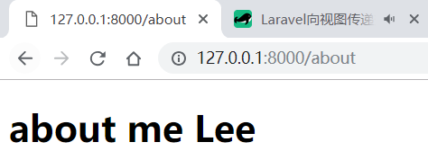

1、新建 **resources\views\sites\about.blade.php**
```html
<!DOCTYPE html>
<html>
<head>
    <title></title>
</head>
<body>
    <h1>about me</h1>
</body>
</html>
```
<!--more--> 
2、新增 **about** 路由

\routes\web.php

```php
<?php

Route::get('/', 'SitesController@index');

Route::get('/about', 'SitesController@about');
```

3、控制器新增 **about** 方法

\app\Http\Controllers\SitesController.php

```php
<?php

namespace App\Http\Controllers;

use Illuminate\Http\Request;

class SitesController extends Controller
{
    // Route::get('/', 'SitesController@index');
    public function index () {
        return view('welcome');
    }

    // Route::get('/about', 'SitesController@about');
    public function about () {
        return view('sites.about');
    }
}
```

要访问 **resources/views/sites/about.blade.php** 页面，可以有两种方式：
- return view('sites/about');
- return view('sites.about'); **（推荐）**

访问 [http://127.0.0.1:8000/about](http://127.0.0.1:8000/about)，效果如图所示：


<hr>

# 向视图传递变量

1、 **with()** 与 原生渲染

```php
public function about () {
    $name = 'Lee';
    return view('sites/about')->with('name', $name);
}
```

```html
<!DOCTYPE html>
<html>
<head>
    <title></title>
</head>
<body>
    <h1>about me <?= $name; ?></h1>
</body>
</html>
```

2、 使用 **blade** 模板引擎语法来渲染

我们注意到视图文件都是 **.blade.php** 文件，所以理所应当使用更简洁的模板渲染语法。

```html
<!DOCTYPE html>
<html>
<head>
    <title></title>
</head>
<body>
    <h1>about me {{ $name }}</h1>
</body>
</html>
```

**{!! $name !!}** 的语法可以用来解析html。譬如 $name 的值为 `<span style='color: red'> Lee </span>` 时，但要小心xss 攻击！




3、使用数组传递多个变量

```php
public function about () {
    return view('sites/about')->with([
        'first' => 'Lee',
        'last' => 'Mp'
    ]);
}
```
```html
<!DOCTYPE html>
<html>
<head>
    <title></title>
</head>
<body>
    <h1>about me {{$first}} {{$last}}</h1>
</body>
</html>
```

4、类 yii 的传递方式
```php
public function about () {
    $data = [];
    $data['first'] = 'Lee';
    $data['last'] = 'Mp';
    return view('sites/about', $data);
}
```

5、 **compact** 方式**（推荐）**
```php
public function about () {
    $first = 'Lee';
    $last = 'Mp';
    return view('sites/about', compact('first', 'last'));
}
```

