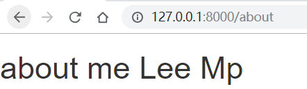
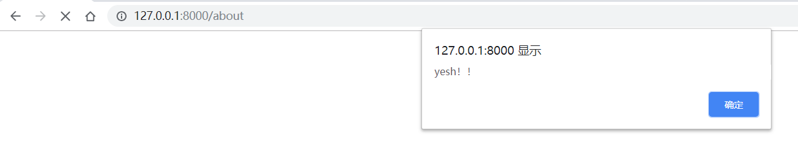
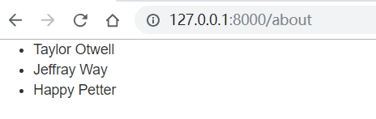

# @yield 语法

中文理解为区域，在母版页（layouts）中会使用。类似 Vue 中的 `<slot name='content'>` 标签。 

新建 **\resources\views\layouts\app.blade.php**

```html
<!DOCTYPE html>
<html>
<head>
    <title></title>
    <script src="https://cdnjs.cloudflare.com/ajax/libs/jquery/1.9.1/jquery.min.js"></script>
    <link rel="stylesheet" href="https://cdn.bootcss.com/twitter-bootstrap/3.3.6/css/bootstrap.min.css">
    <script src="https://cdn.bootcss.com/twitter-bootstrap/3.3.6/js/bootstrap.min.js"></script>
</head>
<body>
    @yield('content')
</body>
</html>
```

\resources\views\sites\about.blade.php
<!--more--> 
```html
@extends('layouts/app')
@section('content')
    <h1>about me {{$first}} {{$last}}</h1>
@stop
```

### 语法说明：
- **@extends**：继承 `\resources\views\layouts\app.blade.php` 模板；
- **@section**：将内容填充到 `@yield('content')` 中；
- **@stop**：通常一个 `@section` 对应一个 `$stop`；

可以发现 **bootstrap** 的样式起到效果了：



<hr>

# 特定的页面加载特定的js文件

其实非常简单，只需要在 `layouts` 中新增多个@yield，在特定的页面选择性填充这个区域即可。

```html
<!DOCTYPE html>
<html>
<head>
    <title></title>
    <script src="https://cdnjs.cloudflare.com/ajax/libs/jquery/1.9.1/jquery.min.js"></script>
    <link rel="stylesheet" href="https://cdn.bootcss.com/twitter-bootstrap/3.3.6/css/bootstrap.min.css">
    <script src="https://cdn.bootcss.com/twitter-bootstrap/3.3.6/js/bootstrap.min.js"></script>
</head>
<body>
    @yield('content')
    @yield('footer')
</body>
</html>
```

```html
@extends('layouts/app')
@section('content')
    <h1>about me {{$first}} {{$last}}</h1>
@stop

@section('footer')
    <script>alert('yesh！！')</script>
@stop
```



<hr>

# @if 语法
```html
@extends('layouts/app')
@section('content')
    @if ($first == "Zhou")
        <h1>about me {{$first}} {{$last}}</h1>
    @else
        <h2>nothing</h2>
    @endif
@stop
```

<hr>

# @foreach 语法

先在控制器中导出数组 

\app\Http\Controllers\SitesController.php

```php
public function about () {
    $people = ['Taylor Otwell', 'Jeffray Way', 'Happy Petter'];
    return view('sites/about', compact('people'));
}
```

通常 @foreach 会结合 @if 使用，否则会出现多余的html标签的情况

```html
@extends('layouts/app')
@section('content')
    @if (count($people) > 0)
        <ul>
            @foreach ($people as $p)
                <li>{{ $p }}</li>
            @endforeach
        </ul>
    @endif
@stop
```

