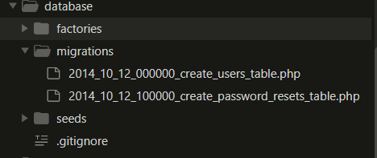
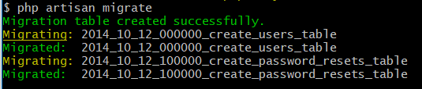
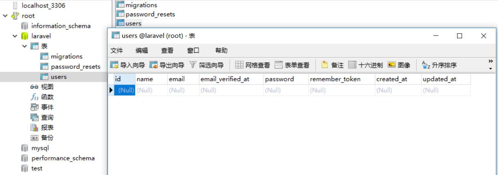
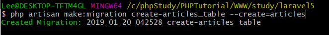
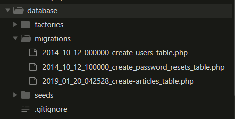
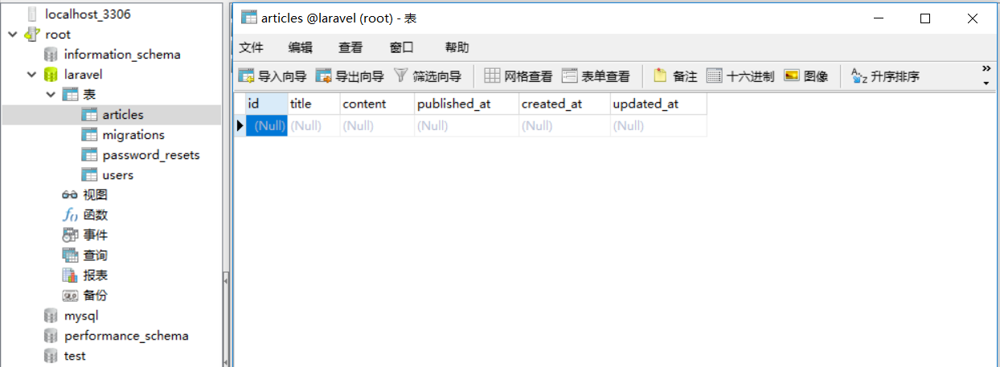
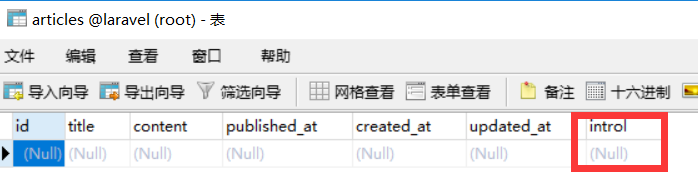

# 一、MySql 数据库配置

先来配置一下数据库，打开 Laravel 的环境配置 `\.env` 文件，简单配置你的数据库信息：

```
DB_CONNECTION=mysql
DB_HOST=127.0.0.1
DB_PORT=3306
DB_DATABASE=laravel
DB_USERNAME=root
DB_PASSWORD=root
```

再打开数据库配置文件 `\config\database.php`，检查当前的 Mysql 数据库配置：

```php
<?php

'default' => env('DB_CONNECTION', 'mysql'),

'mysql' => [
    'driver' => 'mysql',
    'host' => env('DB_HOST'),
    'port' => env('DB_PORT'),
    'database' => env('DB_DATABASE'),
    'username' => env('DB_USERNAME'),
    'password' => env('DB_PASSWORD'),
    'prefix' => '',
],

// ... otherthing

```

<hr>

# 二、migrate 初体验

Laravel 最强大工具之一：**migration**

如果对 `migration` 的概念不清晰，可以简单理解为数据库的版本控制工具。有了它我们就可以对数据库进行方便的管理和愉快地开发了。


找到 `\database\migrations\`，可以看到Laravel默认帮我们准备了两个 migrations 示例文件。



我们就来学习和使用一下 `2014_10_12_000000_create_users_table.php` 文件：

```php
<?php

use Illuminate\Support\Facades\Schema;
use Illuminate\Database\Schema\Blueprint;
use Illuminate\Database\Migrations\Migration;

class CreateUsersTable extends Migration
{
    /**
     * Run the migrations.
     *
     * @return void
     */
    public function up()
    {
        Schema::create('users', function (Blueprint $table) {
            $table->increments('id');
            $table->string('name');
            $table->string('email')->unique();
            $table->timestamp('email_verified_at')->nullable();
            $table->string('password');
            $table->rememberToken();
            $table->timestamps();
        });
    }

    /**
     * Reverse the migrations.
     *
     * @return void
     */
    public function down()
    {
        Schema::dropIfExists('users');
    }
}

```

代码说明：
- up： 负责创建一个 `users` 表；
- down： 为了避免重复新建，负责删除 `users` 表，**但这也说明每次执行都会清空该表的数据**；


```bash
$ php artisan migrate
```





<hr>

# 三、创建 migration 文件

刚刚我们使用了 Laravel 示例的 migration 文件，现在我们新建一个自己的文章表 `articles`，依然可以通过 `artisan` 命令来创建：

```bash
$ php artisan make:migration create-articles_table --create=articles
```





自动生成文件 `\database\migrations\2019_01_20_042528_create-articles_table.php `，代码如下：

```php
<?php

use Illuminate\Support\Facades\Schema;
use Illuminate\Database\Schema\Blueprint;
use Illuminate\Database\Migrations\Migration;

class CreateArticlesTable extends Migration
{
    /**
     * Run the migrations.
     *
     * @return void
     */
    public function up()
    {
        Schema::create('articles', function (Blueprint $table) {
            $table->increments('id');
            $table->timestamps();
        });
    }

    /**
     * Reverse the migrations.
     *
     * @return void
     */
    public function down()
    {
        Schema::dropIfExists('articles');
    }
}

```

其中 `$table->timestamps();` 建议保留，Laravel 会自动创建并维护 `created_at` 和 `updated_at` 字段。

我们试着添加一些基本字段，代码如下：

```php
<?php

use Illuminate\Support\Facades\Schema;
use Illuminate\Database\Schema\Blueprint;
use Illuminate\Database\Migrations\Migration;

class CreateArticlesTable extends Migration
{
    /**
     * Run the migrations.
     *
     * @return void
     */
    public function up()
    {
        Schema::create('articles', function (Blueprint $table) {
            $table->increments('id');
            $table->string('title');
            $table->text('content');
            $table->timestamp('published_at');
            $table->timestamps();
        });
    }

    /**
     * Reverse the migrations.
     *
     * @return void
     */
    public function down()
    {
        Schema::dropIfExists('articles');
    }
}

```

再次执行 migrate 命令 

```bash
php artisan migrate
```



<hr>

# 四、添加字段

假设我们现在需要为 `articles` 表添加一个简介字段 `intro`。

```bash
$ php artisan make:migration add_intro_column_to_articles --table=articles
```

`\database\migrations\2019_01_20_060259_add_intro_column_to_articles.php` 默认代码如下：

```php
<?php

use Illuminate\Support\Facades\Schema;
use Illuminate\Database\Schema\Blueprint;
use Illuminate\Database\Migrations\Migration;

class AddIntroColumnToArticles extends Migration
{
    /**
     * Run the migrations.
     *
     * @return void
     */
    public function up()
    {
        Schema::table('articles', function (Blueprint $table) {
            //
        });
    }

    /**
     * Reverse the migrations.
     *
     * @return void
     */
    public function down()
    {
        Schema::table('articles', function (Blueprint $table) {
            //
        });
    }
}
```

添加代码：

```php
<?php

use Illuminate\Support\Facades\Schema;
use Illuminate\Database\Schema\Blueprint;
use Illuminate\Database\Migrations\Migration;

class AddIntroColumnToArticles extends Migration
{
    /**
     * Run the migrations.
     *
     * @return void
     */
    public function up()
    {
        Schema::table('articles', function (Blueprint $table) {
            $table->string('introl');
        });
    }

    /**
     * Reverse the migrations.
     *
     * @return void
     */
    public function down()
    {
        Schema::table('articles', function (Blueprint $table) {
            $table->dropColumn('introl');
        });
    }
}
```

又又又执行命令： `$ php artisan migrate`

刷新数据表 `articles` ，成功添加了 `introl` 字段：



事实上，如果真的要执行 `$table->dropColumn` 需要依赖一个第三方包，这里安装一下吧：

```bash
$ composer require doctrine/dbal
```