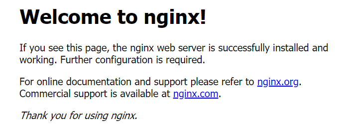

<hr>

### 操作预览：
1. 安装依赖
2. 下载nginx ： http://nginx.org/en/download.html
3. 解压
4. 检查配置是否健康
5. 开始安装
6. 检查是否安装成功，默认安装目录是在/usr/local/nginx
7. 启动nginx服务
8. 查看服务是否开启
9. 使用 `$ curl localhost` 查看 nginx 欢迎页 

<!--more--> 

//////////////////////////////////////////////


##### 1、安装依赖
```bash
$ yum -y install gcc-c++ zlib-devel pcre-devel
```

##### 2、下载nginx ： http://nginx.org/en/download.html
```bash
$ wget http://nginx.org/download/nginx-1.15.8.tar.gz
```

##### 3、解压
```bash
$ tar zxvf nginx-1.15.8.tar.gz
```

//////////////////////////////////////////////

##### 4、检查配置是否健康
```bash
$ ./configure
```

##### 5、开始安装
```bash
$ make && make install
```

//////////////////////////////////////////////

##### 6、检查是否安装成功，默认安装目录是在/usr/local/nginx
```bash
$ /usr/local/nginx/sbin/nginx -t

nginx: the configuration file /usr/local/nginx/conf/nginx.conf syntax is ok
nginx: configuration file /usr/local/nginx/conf/nginx.conf test is successful
```

##### 7、启动nginx服务
```bash
$ /usr/local/nginx/sbin/nginx -c /usr/local/nginx/conf/nginx.conf
```

//////////////////////////////////////////////

##### 8、查看服务是否开启
```bash
$ ps -ef | grep nginx
```

##### 9、使用 `$ curl localhost` 查看 nginx 欢迎页 
```html
<!DOCTYPE html>
<html>
<head>
<title>Welcome to nginx!</title>
<style>
    body {
        width: 35em;
        margin: 0 auto;
        font-family: Tahoma, Verdana, Arial, sans-serif;
    }
</style>
</head>
<body>
<h1>Welcome to nginx!</h1>
<p>If you see this page, the nginx web server is successfully installed and
working. Further configuration is required.</p>

<p>For online documentation and support please refer to
<a href="http://nginx.org/">nginx.org</a>.<br/>
Commercial support is available at
<a href="http://nginx.com/">nginx.com</a>.</p>

<p><em>Thank you for using nginx.</em></p>
</body>
</html>
```

